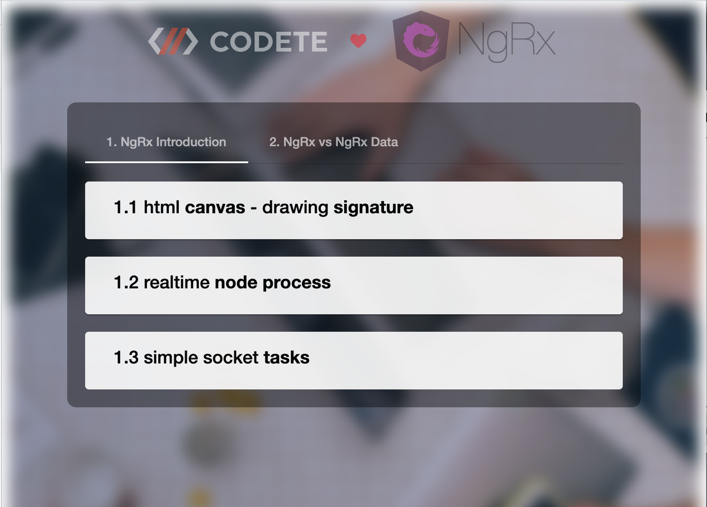
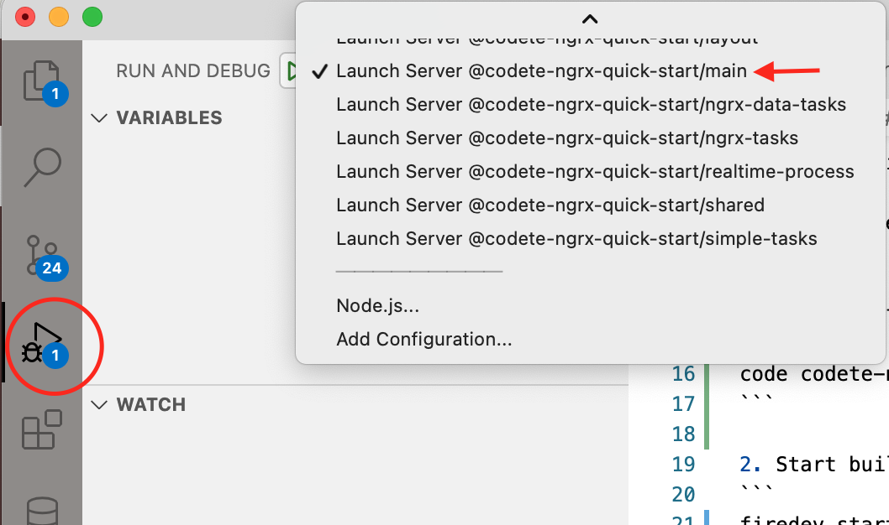

# CODETE NGRX QUICK START

<p style="text-align: center;"></p>

<p style="text-align: center;"></p>

# Installation & build

1. Install firedev:
```
npm i -g firedev
```

2. Clone project:
```
git clone https://github.com/codete/codete-ngrx-quick-start.git
```

3. Open it in Visual Studio Code:
```
code codete-ngrx-quick-start
```

4. Start build
```
firedev start
```

5. Start server:

Select proper debug task and press F5 on keyboard




6. Open browser: http://localhost:4200


# QA

- **How to start application on different port ?**

*firedev start --port 3333*


- **How to start server on different port ?**

*modify host variable in ./shared/src/lib/constants.ts*


- **How to start server wihout Visual Studio Code ?**

*npx ts-node run.js*


- **Can I use different editor than Visual Studio Code ?**

*sure .. but remember that firedev cli generates lots of additional things for VSCode like: config for hidden files, launching server and gonna have to create these things by yourself*


# Technologies
- Sqlite/MySql/Sql.js (database)
- Node JS/ExpressJs/TypeOrm (backend)
- Socket.io (realtime communication)
- Angular/NgRx/RxJS (frontend engine)
- Angular Material (frontend UI)