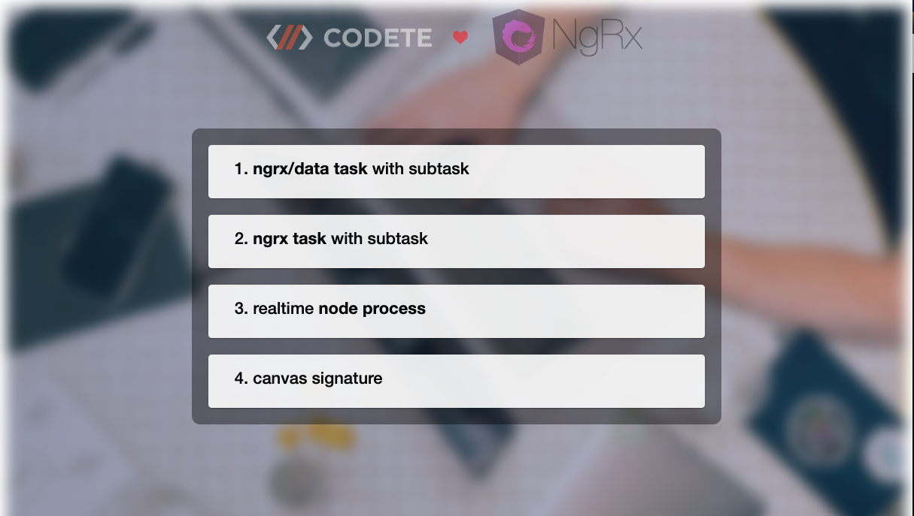
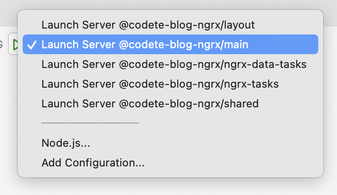
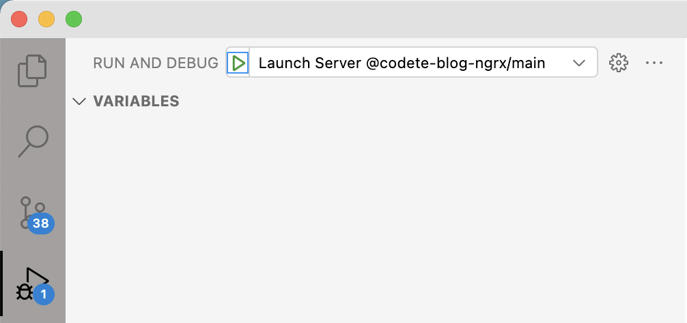

# CODETE NGRX QUICK START

<p style="text-align: center;"></p>

<p style="text-align: center;"></p>

# Installation & build

1. Install firedev, ts-node:
```
npm i -g firedev ts-node
```

2. Start build:
```
cd codete-ngrx-quick-start
firedev build:watch main
```

3. Start server:
```
ts-node run.json
```
or in Visual Studi code select proper debug task and press F5 on keyboard





4. Open browser: http://localhost:4200
