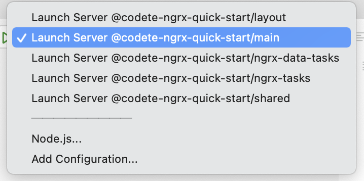
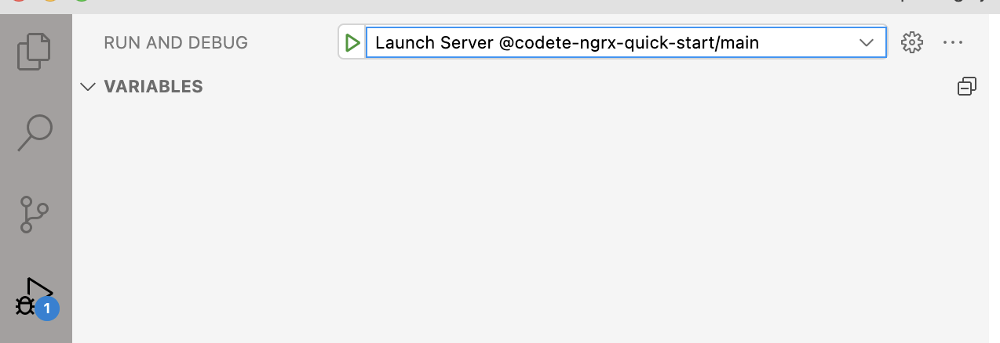

# CODETE NGRX QUICK START

<p style="text-align: center;"></p>

<p style="text-align: center;"></p>

# Installation & build

1. Install firedev
```
npm i -g firedev
```

2. Start build
```
cd codete-ngrx-quick-start
firedev build:watch main
```

3. Start serve
```
ts-node run.json
```
or in vscode select proper debug task and press F5 on keyboard





4. Open browser: http://localhost:4200
