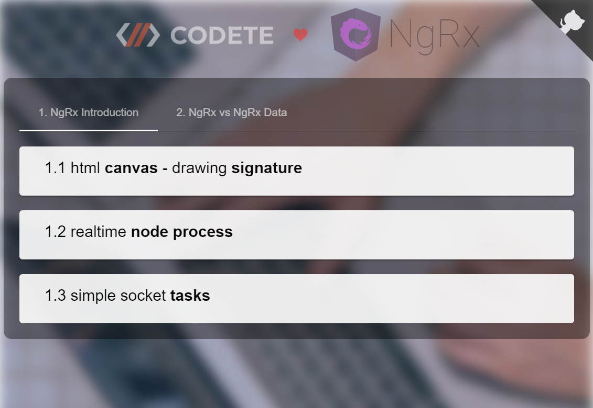

# CODETE NGRX QUICK START

<p style="text-align: center;"></p>

<p style="text-align: center;"></p>

# Installation & build

1. Install firedev:
```
npm i -g firedev
```

2. Clone project:
```
git clone https://github.com/codete/codete-ngrx-quick-start.git
```

2. Open it in Visual Studio Code:
```
code codete-ngrx-quick-start
```

2. Start build:
```
firedev start
```

3. Start server:

Select proper debug task and press F5 on keyboard


4. Open browser: http://localhost:4200

# QA

- **How to start application on different port ?**

*firedev start --port 3333*


- **How to start server on different port ?**

*modify host variable in ./shared/src/lib/constants.ts*

- **How to start server wihout Visual Studio Code ?**

*npx ts-node run.js*


# Technologies
- Sqlite/MySql/Sql.js (database)
- Node JS/ExpressJs/TypeOrm (backend)
- Socket.io (realtime communication)
- Angular/NgRx/RxJS (frontend engine)
- Angular Material (frontend UI)